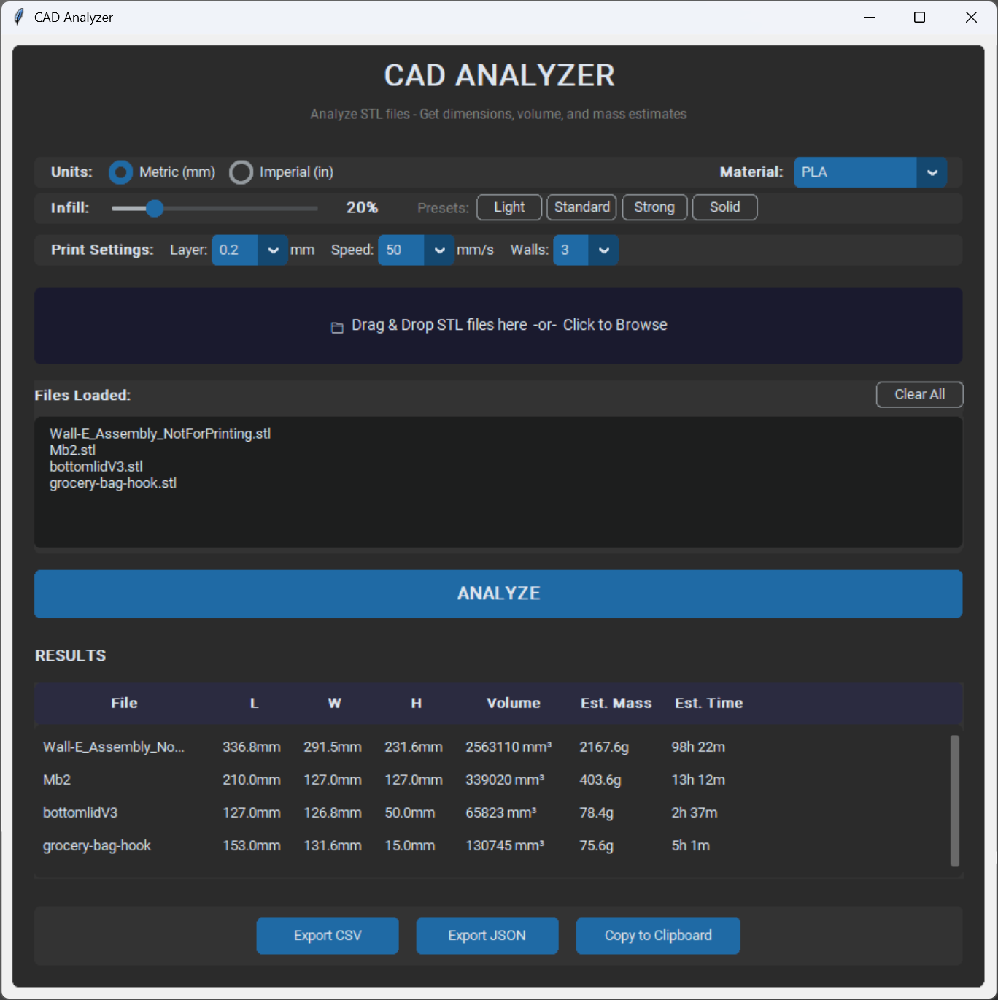

# CAD STL Analyzer

A desktop application for analyzing STL (Stereolithography) files. Computes geometric properties including bounding box dimensions, volume, surface area, and provides mass estimates for 3D printing applications. Designed for engineering documentation and rapid part analysis.




## Features

- Drag-and-drop file input with batch processing support
- Dual unit system supporting metric (mm) and imperial (inches) measurements
- Automatic dimension sorting (Length > Width > Height) from bounding box analysis
- Configurable 3D printing parameters: layer height, print speed, wall count
- Infill percentage adjustment (10-100%) with preset configurations
- Material database with density values for common 3D printing materials and metals
- Mass estimation using slicer-based calculations (shell volume + infill volume)
- Print time estimation based on extrusion rates and layer calculations
- Data export in CSV and JSON formats, with clipboard copy functionality
- CustomTkinter-based graphical user interface with dark theme

## Installation

Clone the repository and install dependencies:

```bash
git clone https://github.com/ysnawara/cad-stl-analyzer.git
cd cad-stl-analyzer
pip install -r requirements.txt
```

## Usage

Launch the application:

```bash
python main.py
```

### GUI Workflow

1. Launch the application
2. Drag and drop STL files onto the drop zone, or use the file browser
3. Configure units (Metric/Imperial) and material selection
4. Adjust print settings and infill percentage as needed
5. Click "ANALYZE" to process files
6. Export results to CSV, JSON, or copy to clipboard

### Command Line Interface

The analyzer module can be used programmatically:

```bash
python analyzer.py path/to/your/file.stl
```

### Export Formats

**CSV Export:**
```csv
File,L (mm),W (mm),H (mm),Volume (mm³),Surface Area (mm²),Mass (g) [PLA]
bracket,45.20,32.80,18.50,2847.300,1245.60,3.53
housing,80.00,60.00,40.00,8523.000,3201.20,10.57
```

**JSON Export:**
```json
{
  "settings": {
    "units": "metric",
    "material": "PLA",
    "density_g_cm3": 1.24
  },
  "results": [
    {
      "filename": "bracket",
      "length": 45.2,
      "width": 32.8,
      "height": 18.5,
      "volume": 2847.3,
      "surface_area": 1245.6,
      "mass_g": 3.53
    }
  ]
}
```

## Supported Materials

| Material | Density (g/cm³) |
|----------|-----------------|
| PLA | 1.24 |
| ABS | 1.04 |
| PETG | 1.27 |
| Nylon | 1.15 |
| TPU | 1.21 |
| Resin | 1.10 |
| Aluminum | 2.70 |
| Steel | 7.85 |
| Titanium | 4.50 |
| Copper | 8.96 |

## Analysis Output

The application computes the following metrics:

- Length (L) - Longest dimension of the axis-aligned bounding box
- Width (W) - Second longest dimension
- Height (H) - Shortest dimension
- Volume - Total mesh volume calculated from triangle geometry
- Surface Area - Sum of all triangle face areas
- Estimated Mass - Calculated using shell and infill volume model
- Estimated Print Time - Based on extrusion rates and layer calculations

## Calculation Methods

### Mass Estimation

The mass calculation follows a slicer-based approach, computing shell and infill volumes separately:

- Shell Mass = Surface Area × Wall Thickness × Number of Walls × Material Density
- Infill Mass = (Total Volume - Shell Volume) × Infill Percentage × Material Density
- Total Print Mass = Shell Mass + Infill Mass

### Print Time Estimation

Print time is estimated using:

- Extrusion Time = Effective Volume / Extrusion Rate
- Extrusion Rate = Layer Height × Nozzle Width × Print Speed
- Layer Change Time = Number of Layers × Average Layer Change Duration
- Travel Time = Extrusion Time × Travel Factor (typically 20-40%)

Total estimated time includes all three components.

### Accuracy Notes

Mass and time estimates have approximately ±30-50% accuracy compared to actual slicer output. For production planning, use dedicated slicing software (PrusaSlicer, Cura) that generates actual G-code toolpaths. These estimates are suitable for preliminary analysis, material planning, and documentation purposes.

## Requirements

- Python 3.8 or higher
- numpy-stl - STL file parsing and mesh operations
- numpy - Numerical computations
- customtkinter - Modern GUI framework
- tkinterdnd2 - Drag-and-drop functionality (optional)

## Building Standalone Executable

To create a standalone executable:

```bash
pip install pyinstaller
pyinstaller --onefile --windowed --name "CAD Analyzer" main.py
```

The compiled executable will be generated in the `dist/` directory.

## Applications

- Engineering documentation and specification generation
- 3D printing material planning and cost estimation
- Batch analysis of part libraries
- Design review and comparison workflows
- Rapid dimensional verification without CAD software

## License

MIT License - see [LICENSE](LICENSE)

